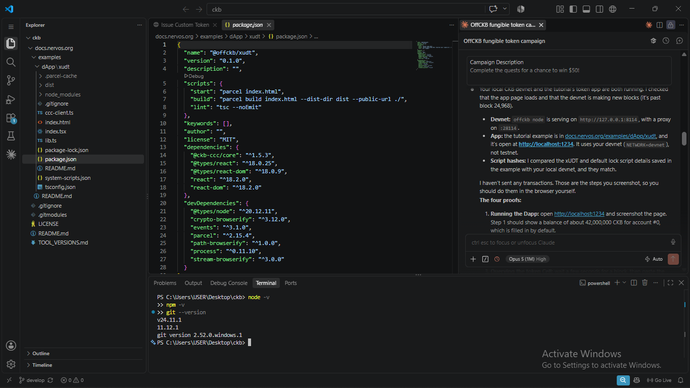
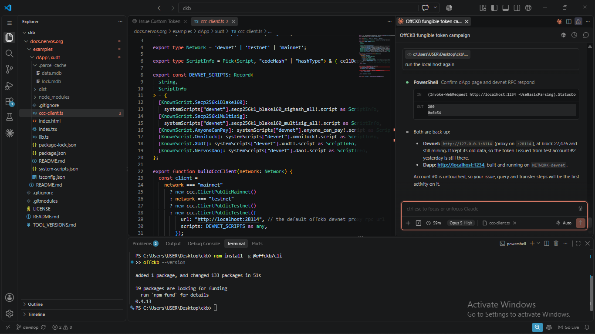
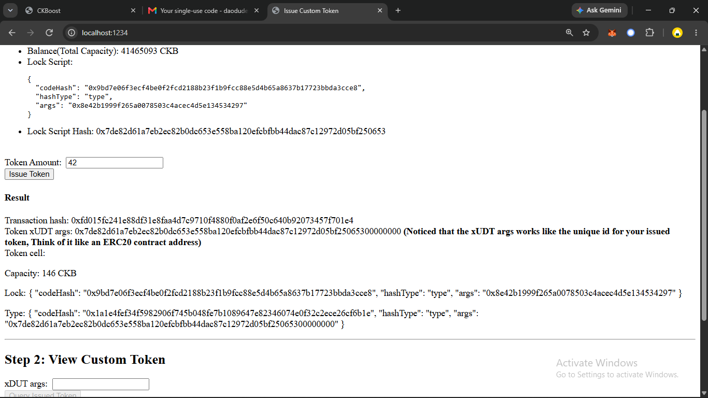
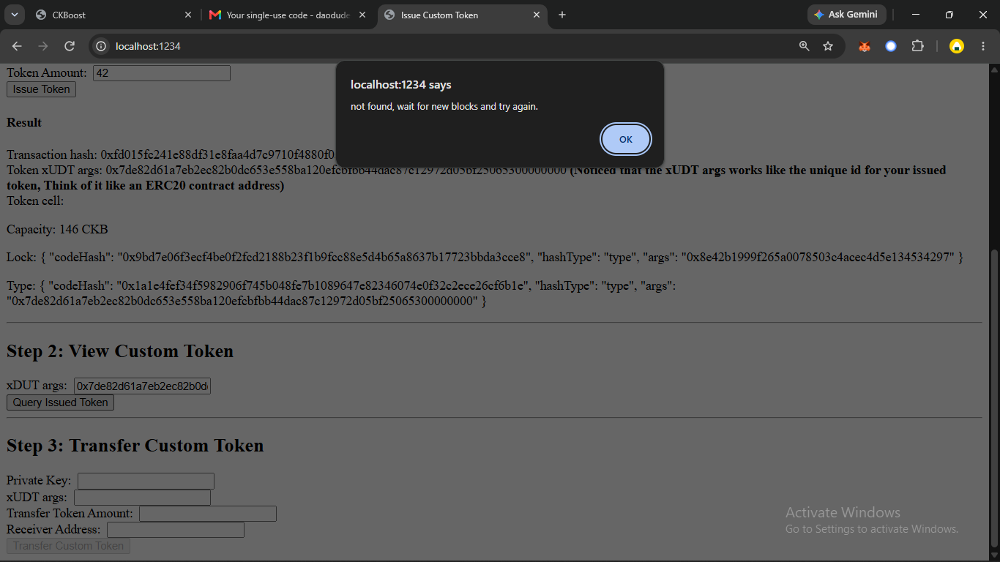
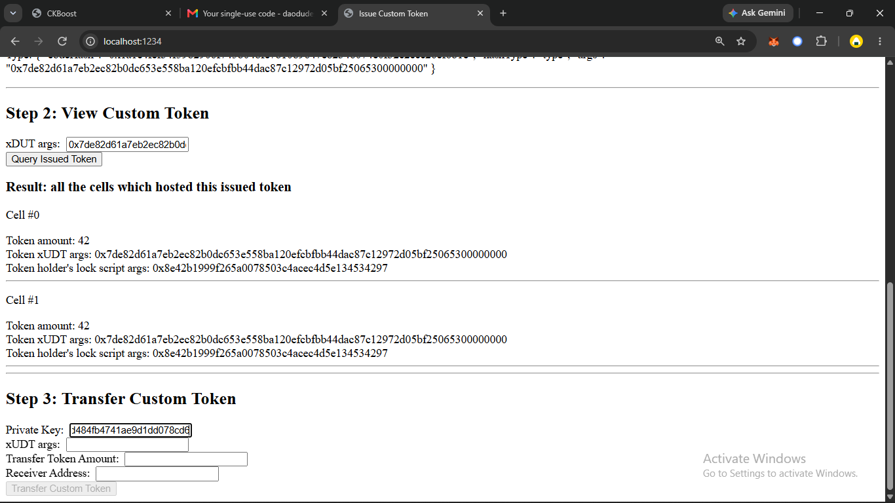

# Create a Fungible Token on CKB — xUDT walkthrough

My completion of the Nervos [Create a Fungible Token](https://docs.nervos.org/docs/dapp/create-token)
tutorial, run against a local CKB devnet with [OffCKB](https://github.com/ckb-devrel/offckb).

This repo holds the tutorial dApp source (from
[docs.nervos.org/examples/dApp/xudt](https://github.com/nervosnetwork/docs.nervos.org/tree/develop/examples/dApp/xudt), MIT),
my screenshots, and the on-chain record of the token I issued and transferred.

---

## Environment

| | |
|---|---|
| OS | Windows 11 Pro (22000) |
| Node / npm | v24.11.1 / 11.12.1 |
| OffCKB | 0.4.13 |
| Chain | local devnet, RPC `127.0.0.1:8114`, proxy `127.0.0.1:28114` |
| SDK | `@ckb-ccc/core` ^1.5.3 |

## Running it

```powershell
offckb node                       # terminal 1: devnet + miner
npm install                       # terminal 2
$env:NETWORK='devnet'; npm start  # PowerShell — see note below
```

The tutorial prints the command as `NETWORK=devnet npm start`, which is bash syntax.
On Windows both cmd and PowerShell reject it with `'NETWORK' is not recognized`.
Worth knowing: if `NETWORK` is unset the client silently falls back to **testnet**
(`ccc-client.ts`), where the devnet keys hold nothing — the app then shows a 0 CKB
balance and a disabled Issue button, with no error explaining why.

App runs at http://localhost:1234.

---

## Proofs of completion

### Setup

Node v24.11.1, npm 11.12.1 and git 2.52.0 in place, then `@offckb/cli` installed and
reporting 0.4.13:




### 1 & 2 — Running the dApp and issuing a custom xUDT

Account #0 holds 41,465,093 CKB on the devnet. Issuing 42 tokens returns the transaction
hash, the xUDT args that identify the token, and the new token cell — 146 CKB of capacity,
carrying my lock script and the xUDT type script:



### 3 — Querying the token cell (the first attempt failed)

My first query returned **"not found, wait for new blocks and try again."** The tutorial's
recap says to query by the issuer's Lock Script Hash, and that is exactly what fails: the
args in the box stop at the 32-byte hash:



Re-querying with the full 36-byte args — the lock hash **plus** the `00000000` flags —
returns both token cells, each holding 42 tokens under the same holder lock args:



### 4 — Transferring tokens by replacing the Lock Script

Three transfers of 10 tokens each went to devnet account #1. A transfer never edits a
balance: it consumes my token cells and creates new ones, one under the receiver's lock
script and one back to me for the change. Swapping the lock script *is* the transfer.

> Screenshot of the Step 3 result and of the post-transfer query still to be added here.

### The token

| | |
|---|---|
| Issuer | devnet account #0, lock args `0x8e42b1999f265a0078503c4acec4d5e134534297` |
| Issuer lock script hash | `0x7de82d61a7eb2ec82b0dc653e558ba120efcbfbb44dac87c12972d05bf250653` |
| **xUDT args (token ID)** | `0x7de82d61a7eb2ec82b0dc653e558ba120efcbfbb44dac87c12972d05bf25065300000000` |
| xUDT code hash (devnet) | `0x1a1e4fef34f5982906f745b048fe7b1089647e82346074e0f32c2ece26cf6b1e` |
| Total supply issued | 210 (5 × 42) |

The token ID is the issuer's lock script hash **plus 4 bytes** (`00000000`, the xUDT
flags field — zero means no extensions). Those 4 bytes matter; see below.

### On-chain record

Every transaction touching this token, reconstructed from the devnet by walking live
cells back through their inputs — no block explorer involved:

| # | Action | Tx | Block | In → Out | Fee | Result |
|---|---|---|---|---|---|---|
| 1 | Issue 42 | `0x3b2d53c8…bf4428` | 24982 | 1 → 2 | 606 | 42 to me |
| 2 | Issue 42 | `0xfd015fc2…f701e4` | 27519 | 1 → 2 | 606 | 42 to me |
| 3 | Transfer 10 | `0xfdf8f190…161f5c` | 27665 | 3 → 3 | 908 | 10 out, 74 change |
| 4 | Transfer 10 | `0xd6301861…9880dc` | 27665 | 2 → 3 | 864 | 10 out, 64 change |
| 5 | Issue 42 | `0x72d28369…8819ac` | 28050 | 1 → 2 | 606 | 42 to me |
| 6 | Transfer 10 | `0x10967111…5c0c9a` | 28068 | 3 → 3 | 908 | 10 out, 96 change |
| 7 | Issue 42 | `0x6d36acd9…d25852` | 28178 | 1 → 2 | 606 | 42 to me |
| 8 | Issue 42 | `0xd47b9da8…82d6aa` | 28180 | 1 → 2 | 606 | 42 to me |

Five issues (210 tokens) and three transfers (30 sent). Live cells now:

```
amount=96  lock args 0x8e42b199…4297   (account #0, change from tx 6)
amount=42  lock args 0x8e42b199…4297   (account #0, from tx 7)
amount=42  lock args 0x8e42b199…4297   (account #0, from tx 8)
amount=10  lock args 0x758d311c…457d   (account #1)
amount=10  lock args 0x758d311c…457d   (account #1)
amount=10  lock args 0x758d311c…457d   (account #1)
```

210 issued, 210 live. Two details that only make sense once you see this table:

**Amounts never merge.** My 180 tokens sit in three cells (96 + 42 + 42), and account
#1's 30 sit in three cells of 10. "Balance" is a sum the UI computes, not a number the
chain stores. Tx 3 shows the flip side: transferring 10 consumed **both** 42-token cells
as inputs, because the wallet gathers whatever cells it needs and writes the remainder
back as change.

**Each cell pays its own rent.** All six lock up exactly **146 CKB** — 8 bytes of
capacity field, the 53-byte lock script, the 69-byte xUDT type script, and 16 bytes of
amount, at 1 CKB per byte. 876 CKB is immobilised to hold 210 tokens. Consolidating
those six cells into two would free up 584 CKB, which is a real consideration on a
network where storage is the scarce resource.

Fees ran 606 shannons for an issue and 864–908 for a transfer — about 0.000006 CKB,
since `completeFeeBy(signer, 1000)` sets a rate per 1000 bytes rather than a flat fee.

---

## Issues I hit in the tutorial

Each of these I ran into or verified against the devnet, not just read:

1. **The recap says to "query the custom token Cell by passing the Lock Script Hash of
   the token issuer."** Doing exactly that returns nothing — my first query failed this
   way. The type script args are the lock hash *plus* the 4-byte flags field; querying by
   the 32-byte hash alone found 0 cells, and the 36-byte args found every cell. The
   tutorial contradicts itself here: the prose in the query section correctly says
   "xUDTArgs," but the overview and recap say "Lock Script Hash."
2. **`NETWORK=devnet npm start` is bash-only**, and the fallback to testnet is silent.
3. **`completeFeeBy(signer, 1000)` is commented as "additional 0.001 ckb for tx fee."**
   That argument is a fee *rate* (shannons per 1000 bytes). My real fees were 606–908
   shannons, roughly 0.000006–0.000009 CKB — over 100× smaller than the comment claims.
4. **The Issue button enables above 61 CKB**, but an xUDT cell needs 146. An account
   funded with 100 CKB passes the check and then fails with `Insufficient CKB, need 46
   extra CKB`. 61 CKB is the floor for a *plain* cell, before the type script and data.
5. **Decimal amounts crash.** The amount box accepts `1.5`; `numLeToBytes` throws
   `Cannot convert 1.5 to a BigInt`. xUDT amounts are `u128`, integers only.
6. **Stale Lumos references in the docs.** The tutorial mentions
   `helpers.TransactionSkeleton` and the type `HexString`, neither of which exists in the
   CCC code the example actually uses; one snippet logs an undefined variable `hash`
   instead of `txHash`; and it calls the function `IssueToken` when it is `issueToken`.
7. **The xUDT spec links point at a personal fork** (`XuJiandong/rfcs`) rather than the
   merged [RFC-0052](https://github.com/nervosnetwork/rfcs/blob/master/rfcs/0052-extensible-udt/0052-extensible-udt.md).
8. **UI nits:** the Step 2 label reads "xDUT args," and the private key field alerts on
   every keystroke, so pasting is the only practical way to fill it.

---

## What I built on top: [xUDT Studio](studio/)

Following the tutorial taught me the three operations; `studio/` is my own app that puts
them together. It starts from an account rather than from a token id: pick a devnet
account, see its CKB and every xUDT it holds, issue, transfer, then inspect any token's
holders cell by cell.

It also fixes the problems listed above — args that explain themselves instead of
"not found", capacity computed from the real scripts instead of a hard-coded 61 CKB,
integer-only amounts, devnet by default, and private keys that never touch disk.

The chain logic lives in `studio/src/ckb.ts` with no React in it, so `npm run smoke`
runs the same functions the browser runs against a live devnet and asserts on the
results. Details in [studio/README.md](studio/README.md).

```powershell
cd studio; npm install; $env:NETWORK='devnet'; npm start   # http://localhost:1235
```

## Reflection

<!-- Write this yourself, in your own voice. The campaign asks for it explicitly, and it
     is the part that decides the prize. Questions worth answering, each tied to
     something that actually happened above:

     1. The query that returned "not found" — what did you assume the token's id was,
        and what was it really? Why do you think the docs describe it the other way?
     2. You issued five times and got five separate cells, not one growing balance.
        When did that click, and what does it change about how you'd write a wallet?
     3. A transfer swaps a lock script. What can you do with that which an ERC-20
        balance mapping makes hard?
     4. 876 CKB is locked up to hold 210 tokens. Is paying rent for your own storage
        a fair trade? What does it prevent?
     5. What would you build with this now — and what stopped you today?

     Answer in your words, keep the bits you got wrong, and delete this comment. -->

---

## Credits

dApp source: [nervosnetwork/docs.nervos.org](https://github.com/nervosnetwork/docs.nervos.org)
`examples/dApp/xudt` (MIT). Devnet tooling: [OffCKB](https://github.com/ckb-devrel/offckb).
